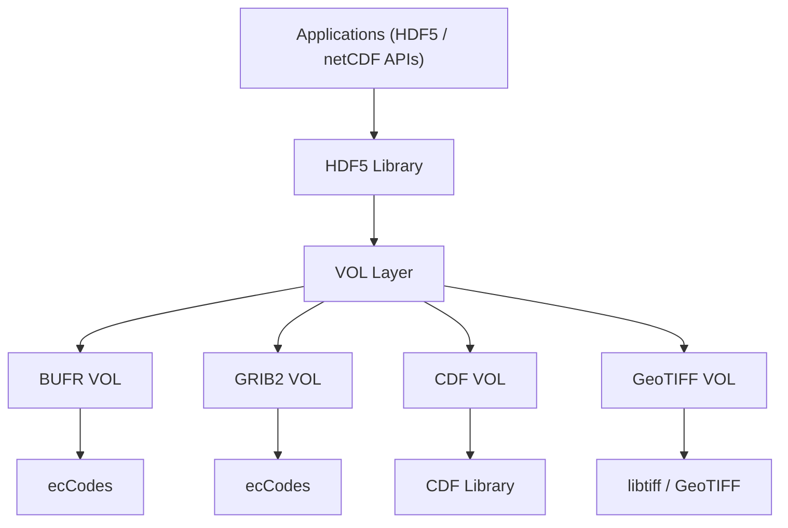

# HDF5 VOL Connectors to Earth Sciences Binary Data Formats

<!--

-->
---

## Overview

The **HDF5 VOL Connectors** project provides a set of HDF5 Virtual Object Layer (VOL) connectors that enable unified access to multiple scientific data formats through standard HDF5 APIs.

Supported formats include:

* BUFR
* GRIB2
* CDF
* GeoTIFF

By mapping format-specific data structures to the HDF5 object model, this project allows applications to **discover and read heterogeneous data using a single interface**, eliminating the need for format-specific application logic.

---

## Architecture

---

## Key Features

* Unified access to multiple scientific data formats via HDF5 APIs
* Transparent mapping of heterogeneous data to HDF5 objects
* Cross-platform build system (CMake)
* Integration with external libraries:

  * ecCodes (BUFR, GRIB2)
  * NASA CDF library
  * libtiff / GeoTIFF

---

## Supported Formats

| Format  | Description                       |
| ------- | --------------------------------- |
| BUFR    | Meteorological observational data |
| GRIB2   | Gridded meteorological data       |
| CDF     | Space science data                |
| GeoTIFF | Geospatial raster imagery         |

---

## Quick Start

### Build
Each connector is built separately. See `doc/usage.md` file for building instructions.

### Examples
Each connector comes with an example that shows how to access data via HDF5 APIs. `C` programs can be found in the `examples` directory under each VOL folder. 

---

## Project Status

This project is an **initial release** intended for:

* evaluation
* integration testing
* research workflows

Functionality and mappings will continue to evolve. For more details check documentation in the `doc` subdirectories of each connector repo.

---

## Known Limitations

* Read-only support (no write functionality yet)
* Partial support for complex structures (e.g., BUFR replication)
* Limited selection and datatype conversion support
* Performance optimizations ongoing
* For CDF, BUFR and GRIB2 connector testing was performed only on a limited number of binary files. Testing is ongoing.

---
<!--
## Documentation

See the [Releases](https://github.com/LifeboatLLC/DataFormats-VOLs/releases) page for detailed release notes.

---
-->

## Contributing

Contributions, issues, and feedback are welcome.

---

## License

Connectors are open-source and come with 3 clause BSD license. See COPYING file in each VOL folder.

---

